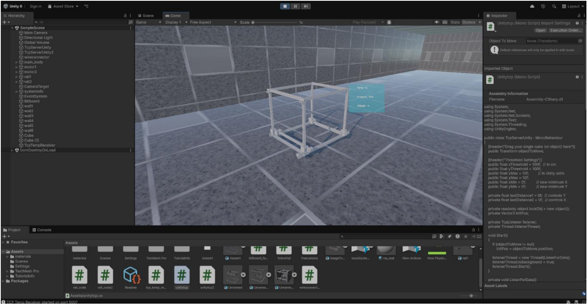
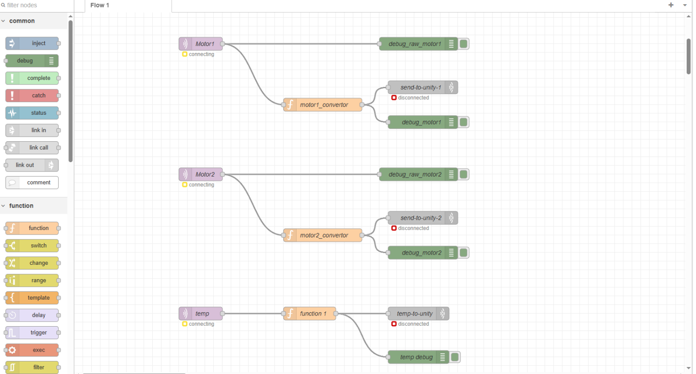

# 🔥 Hot-Wire Digital Twin (IoT + Unity 3D)

A full **IoT-based Digital Twin system** that visualizes real-world sensor data in a **Unity 3D environment**.  
This project connects **ESP32 hardware**, **sonar distance sensors**, and **ThingsBoard cloud platform** using **MQTT and WebSocket**, while rendering a **real-time 3D digital twin** created with **Blender** and Unity.

---

## 🌐 Project Overview

The system measures physical distance using **ultrasonic (sonar) sensors** connected to an **ESP32**, sends data to **ThingsBoard** via **MQTT**, and streams live telemetry to **Unity** using **WebSocket / TCP communication**.  
The Unity scene updates object movement in real time, forming a true **digital twin** of the physical setup.

---

## ✨ Features

- 🧠 **Real-Time Digital Twin**
  - Physical system mirrored in Unity 3D
  - Live movement based on sensor data

- 📡 **ESP32-Based Data Acquisition**
  - Ultrasonic (sonar) distance measurement
  - Real-world object position tracking

- ☁️ **ThingsBoard IoT Platform**
  - Telemetry visualization
  - Device management
  - Dashboard monitoring

- 🔗 **MQTT Communication**
  - ESP32 → ThingsBoard
  - Low-latency, lightweight messaging

- 🌍 **WebSocket / TCP Streaming**
  - Real-time data flow to Unity
  - Smooth object synchronization

- 🎮 **Unity 3D Visualization**
  - Digital twin simulation
  - Dynamic object movement
  - UI overlays for live values

- 🧱 **3D Models with Blender**
  - Custom models for the digital twin
  - Optimized for real-time rendering

---

## 🎬 Live Demo

### Digital Twin in Action (GIF)

---

## 🖼️ System Interface & Workflow

### Unity Interface

### ThingsBoard Workflow

---

## 🧩 System Architecture

[ Ultrasonic Sensors ]
↓
[ ESP32 ]
↓ (MQTT)
[ ThingsBoard ]
↓ (WebSocket / TCP)
[ Unity 3D ]
↓
[ Digital Twin ]

---

## 🛠️ Technologies Used

### Hardware
- **ESP32**
- **Ultrasonic (Sonar) Sensors**
- Power & interface circuitry

### Software & Platforms
- **Unity 3D**
- **Blender**
- **ThingsBoard**
- **MQTT**
- **WebSocket / TCP**
- **C# (Unity Scripts)**
- **Embedded C / Arduino (ESP32)**

---

## 📂 Project Structure

hotwire-digital-twin/
│
├── ScreenShots/
│ ├── interface.png
│ ├── test.gif
│ └── things_board_workflow.png
│
├── Unity/
│ ├── Assets/
│ ├── Scripts/
│ └── Scenes/
│
├── ESP32/
│ ├── esp32_firmware.ino
│ └── mqtt_config.h
│
├── Blender/
│ └── 3d_models.blend
│
├── Docs/
│ └── system_architecture.pdf
│
└── README.md

---

## ▶️ How It Works

1. **Sonar sensors** measure distance
2. **ESP32** reads sensor values
3. Data is published to **ThingsBoard** using **MQTT**
4. Unity subscribes to live updates via **WebSocket / TCP**
5. 3D objects move in real time based on sensor input

---

## 🎯 Learning Objectives

This project demonstrates:
- Digital Twin architecture
- Real-time IoT data pipelines
- MQTT & WebSocket communication
- Unity integration with live hardware
- Cloud-based telemetry (ThingsBoard)
- Embedded + 3D visualization synergy

---

## 🔮 Future Improvements

- 📊 Advanced analytics in ThingsBoard
- 🔁 Bidirectional control (Unity → ESP32)
- 📡 Multiple sensor nodes
- 🧠 AI-based anomaly detection
- 🌐 Web-based digital twin viewer

---

## 👤 Author

**Amirhossein Soleimani**  
IoT | Embedded Systems | Unity | Qt/QML Developer  

📧 Email: amirsoleimani123456789@gmail.com  
🐙 GitHub: https://github.com/your-username

---

## 📜 License

This project is developed for **educational and research purposes**.  
You are free to modify and extend it with proper attribution.
